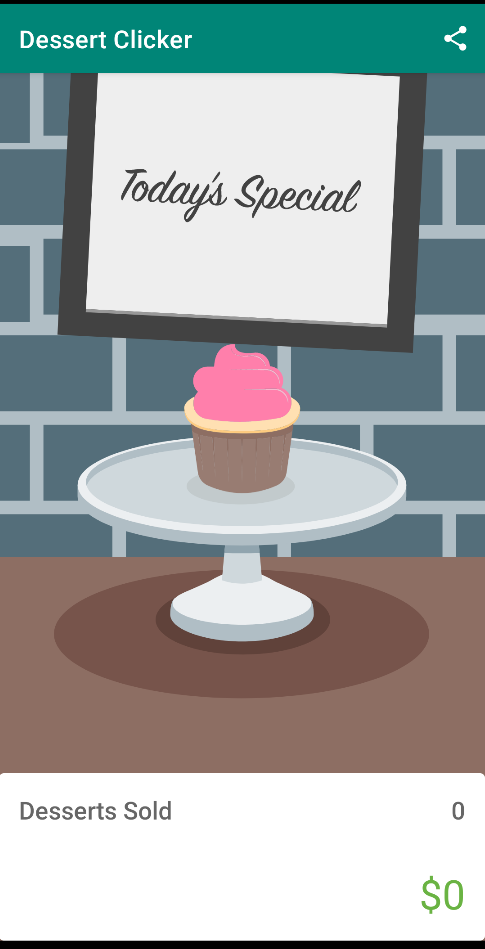

Dessert Clicker
============

# Description
each time the user taps a dessert on the screen, the app "purchases" the dessert for the user.
The app updates values in the layout for the number of desserts that were purchased, and for
the total amount the user spent.

Project sourced from:
- [Stages of the activity lifecycle](https://developer.android.com/codelabs/basic-android-kotlin-training-activity-lifecycle)
- Starter code for the independent project for [google-developer-training/android-basics-kotlin-dessert-clicker-app](https://github.com/google-developer-training/android-basics-kotlin-dessert-clicker-app/tree/starter).

### Screenshots
Screenshots of the project

#### Homepage view

## Concepts

### Activity lifecycle
Is the set of states an activity can be in during its lifetime. The lifecycle extends from when
the activity is initially created to when it is destroyed and the system reclaims that activity's
resources. As a user navigates between activities in your app (and into and out of your app),
those activities each transition between different states in the activity lifecycle.
- Activity class itself, and any subclasses of Activity such as AppCompatActivity, implement a set
of lifecycle callback methods
- Android invokes these callbacks when the activity moves from one state to another, and you can
override those methods in your own activities to perform tasks in response to those lifecycle 
state changes

TODO:

### Common attributes
- When you override the onCreate() method, you must call the superclass implementation to complete
the creation of the Activity, so within it, you must immediately call super.onCreate(). The same
is true for other lifecycle callback methods.

### onCreate()
- onCreate() method is the one method every activity must implement
- is where you should do any one-time initializations for your activity
  - you inflate the layout, define click listeners, or set up view binding
- The onCreate() lifecycle method is called once, just after the activity is initialized 
  - After onCreate() executes, the activity is considered created

### onStart()
- After onStart() runs, your activity is visible on the screen
- onStart() can be called many times in the lifecycle of your activity
  - onRestart()

### onResume()
- is called at startup, even if there is nothing to resume
- the app gains the user focus, that is, the user can interact with the app
- interactive lifecycle: part of the lifecycle in which the app is fully on-screen and has user
focus
- method is called when the activity has focus

### onDestroy()
- the activity was fully shut down and can be garbage-collected
  - Garbage collection refers to the automatic cleanup of objects that you'll no longer use
- is called, the system knows that those resources are discardable, and it starts cleaning up that
memory.
- Your activity may also be completely shut down if your code manually calls the activity's
finish() method, or if the user force-quits the app.

### onPause()
- the app no longer has focus
- The interruption with only onPause() usually lasts a short time before returning to your
activity or navigating to another activity or app
- Whatever code runs in onPause() blocks other things from displaying, so keep the code in
onPause() lightweight
- is called when the activity loses focus

#### partially visible
The difference between focus and visibility is important because it is possible for an activity
to be partially visible on the screen, but not have the user focus.

### onStop()
- the app is no longer visible on screen
- the Activity object is still in memory, in the background
- If the user starts your app and then returns to the device's home screen, the activity is 
stopped and is no longer visible on screen.

### onRestart()
- does not create new activity object
- data is retained
- is called before the activity becomes visible
- is a place to put code that you only want to call if your activity is not being started for
the first time.

## Configuration change
A configuration change happens when the state of the device changes so radically that the easiest
way for the system to resolve the change is to completely shut down and rebuild the activity

### onSaveInstanceState()
The onSaveInstanceState() method is a callback you use to save any data that you might need if the
Activity is destroyed.
- is called after the activity has been stopped
- it's called every time your app goes into the background
- gives you a chance to save a small amount of information to a bundle as your activity exits the
foreground

#### Two overrides for onSaveInstanceState()
one with just an outState parameter, and one that includes outState and outPersistentState
parameters

## Bundle
A Bundle is a collection of key-value pairs, where the keys are always strings. You can put simple
data, such as Int and Boolean values, into the bundle
- the size of this bundle is also limited, though the size varies from device to device. If you
store too much data, you risk crashing your app with the TransactionTooLargeException error.

### putInt()
The putInt() method (and similar methods from the Bundle class like putFloat() and putString()
takes two arguments: a string for the key, and the actual value to save.
- example: `outState.putInt(KEY_REVENUE, revenue)`

## How to run Script locally

This sample uses the Gradle build system.

To build this project, use the "gradlew build" command or use "Import Project" in Android Studio.

## About the Developer
Jessica Dene Earley-Cha    
[Bio](https://www.jessicadeneearley-cha.com/jessica)   
[Linkedin](https://www.linkedin.com/in/jessicaearley)    